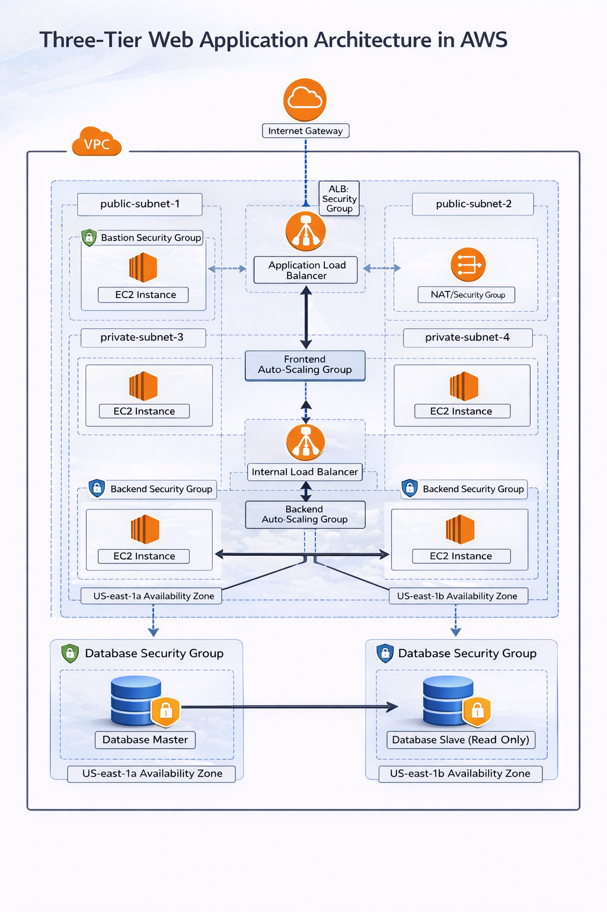

# 🛒 Full-Stack E-Commerce Web Application

A **modern, cloud-native full-stack e-commerce platform** designed, built, and deployed from scratch to demonstrate real-world **software engineering, cloud architecture, and DevOps practices**.

This project goes beyond application development by provisioning and managing the entire **AWS infrastructure using Terraform**, following a **production-style three-tier architecture**.

)

---

## 📸 Architecture Overview

> *High-level AWS infrastructure and application flow*



---

## 🚀 Features

### Frontend

* ⚛️ React + Tailwind CSS
* 📱 Fully responsive UI
* 🧩 Reusable components
* 🛒 Dynamic cart interactions
* 🖼️ Graceful image fallbacks
* 🔐 Auth-aware conditional rendering

### Backend

* 🐍 Django + Django REST Framework
* 🔑 JWT-based authentication
* 📦 Product & category management
* 🛒 Cart and user operations
* 📡 RESTful API design

### Cloud & DevOps

* ☁️ AWS cloud infrastructure
* 🏗️ Infrastructure as Code (Terraform)
* 📈 Auto Scaling EC2 instances
* 🌐 Application Load Balancer (ALB)
* 🛡️ Bastion host for secure access
* 🗄️ RDS PostgreSQL with read replica support
* 🔒 Environment-based configuration & security groups

---

## 🏗️ Architecture (Three-Tier Design)

```
Client (Browser)
    ↓
Public ALB (HTTP)
    ↓
Frontend EC2 (Auto Scaling)
    ↓
Backend API (Private Subnets)
    ↓
PostgreSQL (RDS)
```

* **Public Layer:** ALB + Bastion Host
* **Application Layer:** Auto Scaling EC2 instances
* **Data Layer:** RDS PostgreSQL (private subnets)

---

## 🧱 Infrastructure Stack

| Layer      | Technology                    |
| ---------- | ----------------------------- |
| Frontend   | React, Tailwind CSS           |
| Backend    | Django, Django REST Framework |
| Database   | PostgreSQL (RDS)              |
| Cloud      | AWS                           |
| IaC        | Terraform                     |
| Compute    | EC2, Auto Scaling             |
| Networking | VPC, Subnets, ALB             |
| Security   | Security Groups, Bastion      |

---

## 📂 Project Structure

```
.
├── frontend/            # React + Tailwind app
├── backend/             # Django REST API
├── terraform/           # AWS Infrastructure as Code
│   ├── vpc.tf
│   ├── subnets.tf
│   ├── alb.tf
│   ├── autoscaling.tf
│   ├── bastion.tf
│   ├── rds.tf
│   ├── security_groups.tf
│   ├── variables.tf
│   ├── outputs.tf
│   └── terraform.tfvars
├── docs/
│   └── architecture-diagram.png
└── README.md
```

---

## ⚙️ Deployment Overview

1. **Provision infrastructure** using Terraform
2. Deploy frontend via EC2 Auto Scaling Group
3. Expose frontend through Application Load Balancer
4. Secure private access via Bastion host
5. Persist data in RDS PostgreSQL

```bash
cd terraform
terraform init
terraform apply
```

---

## 🔐 Security Highlights

* No public access to private subnets
* SSH access only via Bastion host
* Least-privilege security groups
* JWT-based authentication
* Environment-based secrets handling

---

## 📈 Future Improvements

* 🔄 CI/CD pipeline (GitHub Actions)
* 📊 Monitoring & logging (CloudWatch)
* 🔐 HTTPS with ACM & Route 53
* 📦 Docker image registry
* 💸 Cost optimization & on-demand scaling

---

## 🧠 Why This Project Matters

This project demonstrates:

* End-to-end ownership (design → deploy)
* Real-world cloud architecture patterns
* Infrastructure automation with Terraform
* Secure, scalable application deployment

It reflects my growth toward a **DevOps Engineer / Cloud Architect** role.

---

## 🛠️ Tech Stack

**Frontend:** React, Tailwind CSS, JavaScript
**Backend:** Django, Django REST Framework
**Database:** PostgreSQL
**Cloud:** AWS (EC2, ALB, RDS, VPC)
**DevOps:** Terraform, Docker, Linux, Git

---

## 📬 Contact

Feel free to connect with me on **LinkedIn** or explore my other projects here on GitHub.
Linkdin: www.linkedin.com/in/jairon-beriguete

⭐ If you find this project useful, consider giving it a star!
